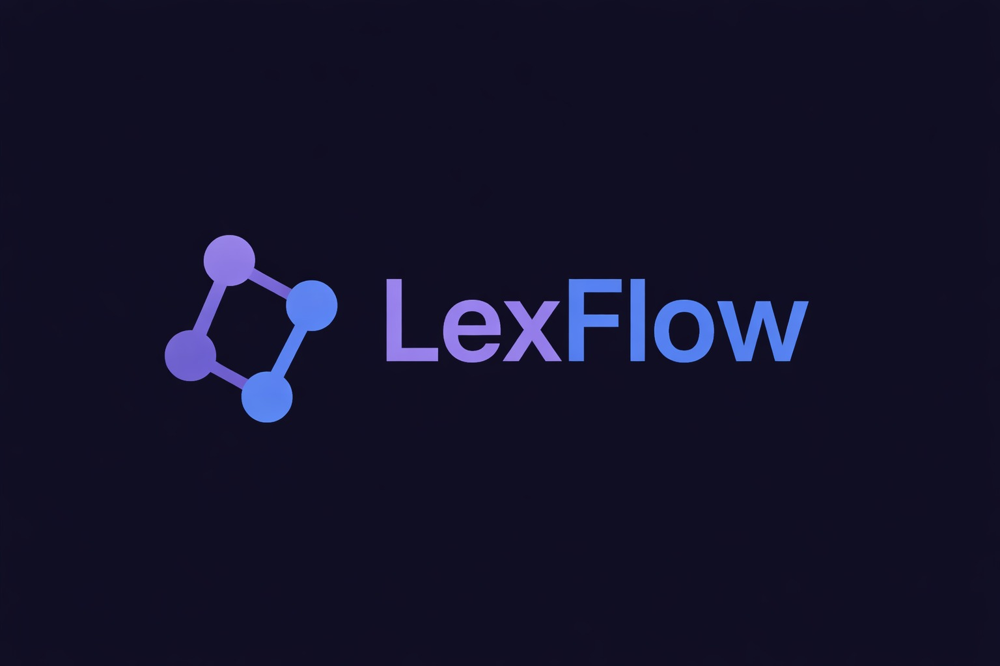

<p align="center">
  
</p>

<h3 align="center">Legislación española, viva y navegable.</h3>

<p align="center">
  Plataforma open source para explorar, analizar y consultar legislación española mediante grafos de conocimiento, IA y dashboards interactivos.
</p>

<p align="center">
  <a href="https://github.com/VforVitorio/LexFlow/blob/main/LICENSE"></a>
  <a href="https://www.python.org/"></a>
  <a href="https://github.com/VforVitorio/LexFlow/issues"></a>
  
</p>

---

## Qué es LexFlow

LexFlow transforma el repositorio [legalize-es](https://github.com/legalize-dev/legalize-es) — una colección de leyes españolas en Markdown versionada con Git — en una plataforma interactiva con cuatro capas:

| Capa | Descripción |
|------|-------------|
| **API REST** | Endpoints FastAPI para leyes, artículos, versiones, diffs, búsqueda y estadísticas |
| **Grafo interactivo** | Visualización tipo Obsidian de relaciones entre normas, artículos y referencias |
| **Chat legal** | Chatbot con acceso a herramientas reales vía MCP (Ollama, LM Studio, OpenAI, Anthropic, Google) |
| **Dashboards** | Paneles de compliance y analítica legislativa con Plotly |

Todo construido en **Python puro** (backend + frontend con [Reflex](https://reflex.dev)), pensado para ser descargado y usado por cualquier persona — sin necesidad de Docker, terminales ni dependencias.

---

## Inicio rápido

### Requisitos

- Python 3.12+
- [uv](https://docs.astral.sh/uv/) (gestor de paquetes recomendado)

### Instalación

```bash
# Clonar el repositorio
git clone https://github.com/VforVitorio/LexFlow.git
cd LexFlow

# Instalar dependencias
uv sync --all-extras

# Arrancar el servidor de desarrollo
uv run python main.py
```

La API estará disponible en `http://localhost:8000`. Documentación interactiva en `/docs`.

> **Nota:** En futuras versiones LexFlow se distribuirá como aplicación de escritorio descargable (`.exe`, `.dmg`, `.AppImage`) para que no necesites instalar nada.

---

## Arquitectura

```text
LexFlow/
├── src/lexflow/
│   ├── api/          # FastAPI — endpoints REST
│   ├── core/         # Modelos de dominio, parsers, lógica de negocio
│   ├── chat/         # Chatbot legal con MCP tools
│   ├── graph/        # Grafo de conocimiento (NetworkX)
│   ├── dashboards/   # Paneles analíticos (Plotly + Reflex)
│   └── utils/        # Configuración, logging, helpers
├── tests/            # Test suite
├── docs/             # Documentación del proyecto
├── assets/           # Imágenes y recursos estáticos
├── .github/          # CI/CD, issue templates, PR template
├── main.py           # Punto de entrada
└── pyproject.toml    # Configuración del proyecto
```

---

## Stack tecnológico

| Componente | Tecnología |
|------------|------------|
| Backend | FastAPI, Pydantic, Uvicorn |
| Frontend | Reflex |
| Grafo | NetworkX |
| Chat / RAG | FastMCP, Ollama, LM Studio, OpenAI, Anthropic, Google |
| Dashboards | Plotly |
| Testing | pytest, pytest-asyncio |
| Linting | Ruff |
| Type checking | mypy |
| Packaging | uv, PyInstaller |

---

## Roadmap

Consulta el [ROADMAP.md](ROADMAP.md) completo para ver todas las fases, hitos y objetivos del proyecto.

**Resumen de fases:**

1. **Cimientos** — API base, parseo de leyes, modelos de dominio
2. **Grafo** — Construcción y visualización del grafo de relaciones legales
3. **Chat** — Chatbot legal con herramientas MCP conectadas a la API
4. **Dashboards** — Paneles de compliance y analítica legislativa
5. **Producto** — Empaquetado como app de escritorio, instaladores, distribución

---

## Contribuir

Las contribuciones son bienvenidas. Lee la [guía de contribución](CONTRIBUTING.md) antes de empezar.

**Flujo rápido:**

1. Abre o busca un [issue](https://github.com/VforVitorio/LexFlow/issues)
2. Crea una rama desde `dev` (`feat/xxx` o `fix/xxx`)
3. Desarrolla y añade tests
4. Abre PR hacia `dev`
5. Review y merge (sin squash)

---

## Créditos

Este proyecto existe gracias a [legalize-es](https://github.com/legalize-dev/legalize-es), el repositorio open source que recopila y versiona legislación española en Markdown. LexFlow construye sobre esa base para convertirla en una plataforma interactiva completa.

---

## Licencia

LexFlow se distribuye bajo la licencia [Apache 2.0](LICENSE).

```
Copyright 2026 VforVitorio

Licensed under the Apache License, Version 2.0
```
